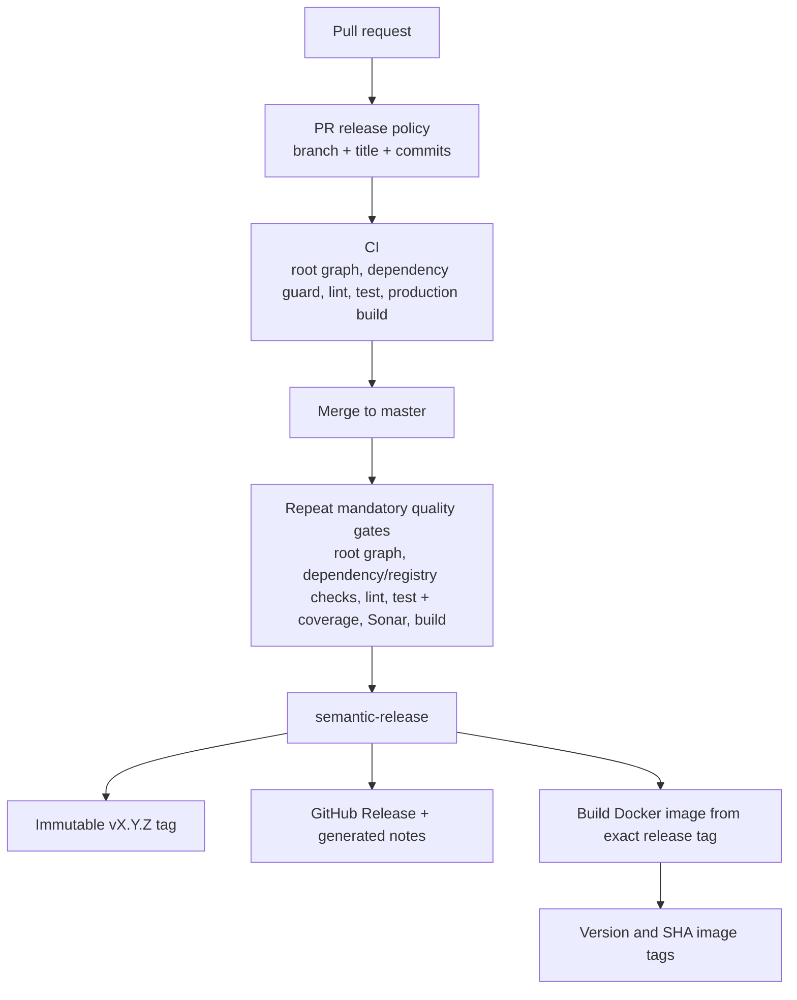

# CI/CD Release Flow

The release job has only `contents: write`, which semantic-release needs for the tag and GitHub Release. It uses the repository `GITHUB_TOKEN`; no PAT, npm publishing plugin, changelog plugin, or Git write-back plugin is configured. It cannot run from a PR or fork because it only triggers on a `master` push. The Sonar step receives only `secrets.SONAR_TOKEN` after Karma creates `coverage/h-budget/lcov.info` and `reports/sonarqube_report.xml`; a failed analysis blocks publishing.

The release workflow detects the new `vMAJOR.MINOR.PATCH` tag created on its checked-out `master` commit and invokes deployment only for that tag. This avoids relying on a second workflow event from a `GITHUB_TOKEN`-created GitHub Release. Deployment checks out the tag, resolves the tagged commit SHA, and labels/images with that SHA. It fails if an existing version or SHA Docker tag resolves to another release. A rerun therefore verifies the existing immutable tags instead of creating another version or deploying `master` by reference.

The GitHub environment named `production` remains on the Docker build/push job, retaining any environment protections configured in GitHub. The workflow builds and pushes the image; an external runtime deployment step is not present in this repository and remains outside this automation. `workflow_dispatch` on the deployment workflow accepts only an explicit existing release tag, then performs the same tag-to-SHA integrity check, preserving safe operational redeploys without allowing manual version creation.
